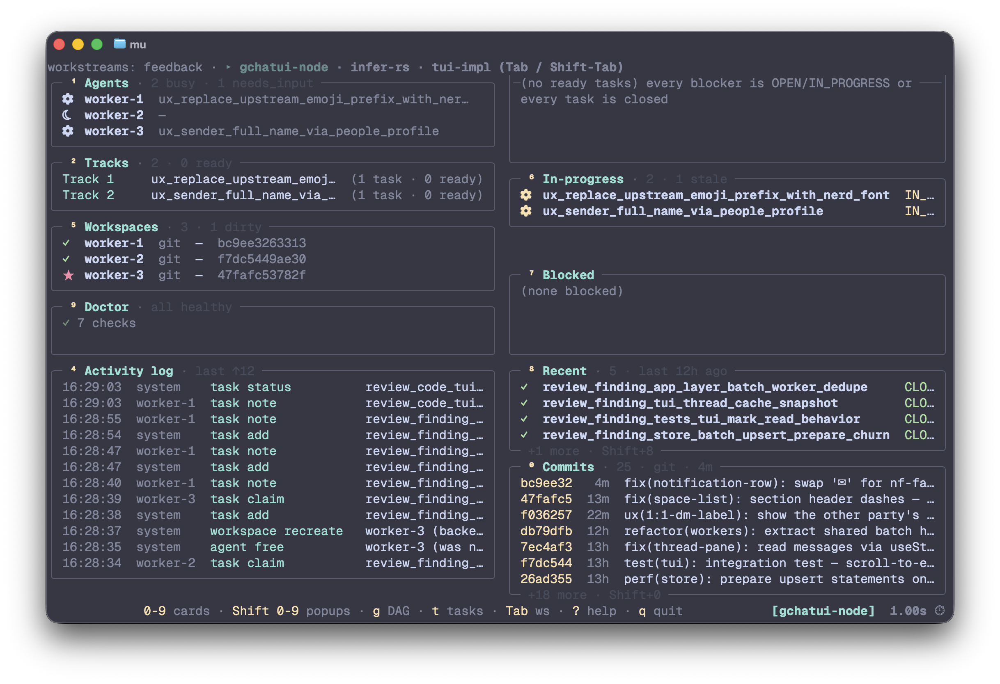

# mu

**A small, opinionated control plane for a crew of AI coding agents
working in parallel.** Tmux panes, a typed task DAG, isolated VCS
workspaces per agent, an audit log — and a dashboard for seeing what
the crew is doing right now.



*`mu` (no args) — read-only dashboard: agents, tracks, ready /
in-progress / blocked tasks, log tail, workspaces, doctor.*

The core loop is: plan work as a DAG, spawn a small crew, and watch
handoffs happen in tmux:

```bash
mu workstream init auth-refactor
mu task add --title "Design auth" --impact 80 --effort-days 2
mu task add --title "Build auth"  --impact 80 --effort-days 5 --blocked-by design_auth

mu agent spawn worker-1 --workspace
mu agent send worker-1 'Pick up the next ready task and design the auth module.'
mu                         # dashboard
```

Need one quick helper without the DAG? `mu agent spawn scout-1 -w
scratch` gives you a low-ceremony agent you can still send/read/wait
on.

Nothing here is a black box. Agents are tmux panes you can `tmux
attach` to, tasks live in a SQLite DAG, and workspaces are real jj
workspaces / sl shares / git worktrees on disk. **mu persists state
and coordinates handoffs; the model still decides what to do.**

For the full copy-paste flow, see [Quick start](#quick-start).

---

## What mu is

- **Parallelism that doesn't trip over itself.** Per-agent VCS
  workspaces plus a real task DAG with deterministic parallel-track
  detection keep agents off each other's toes.
- **A durable coordination layer.** One SQLite registry records
  agents, tasks, ownership, notes, events, snapshots, and workspaces;
  panes can die and humans can come back later.
- **Stay out of the model's way.** Mu coordinates handoffs; it does
  not choose models, providers, or thinking effort. `--cli <key>`
  uppercases to `$MU_<KEY>_COMMAND`, so your shell rc owns the agent
  command.
- **Scriptable without scraping text.** Every read path that matters has
  `--json`, and every state change goes through a typed CLI verb; the
  dashboard is for humans, not the API.
- **A low-ceremony escape hatch.** The reserved `scratch` workstream
  is there when you want one driveable helper without committing to a
  full task graph.

## What mu is NOT

- **Not a build tool.** mu doesn't compile, test, or deploy
  anything.
- **Not a chat protocol.** Agents communicate via the work graph
  and the activity log, never agent-to-agent messaging.
- **Not a verifier.** `task close --evidence "tests pass"` records
  the claim; mu doesn't run the tests.
- **Not a replacement for [pi-subagents](https://github.com/nicobailon/pi-subagents).**
  Mu agents are driveable tmux panes; pi-subagents is for one-shot
  focused delegation. See [vs `pi-subagents`](#vs-pi-subagents).
- **Not a hosted service.** Local-first SQLite.
- **DB-undoable, not tmux-undoable.** Every destructive verb
  auto-captures a whole-DB snapshot first; `mu undo --yes` restores
  the DB. Killed panes and freed workspace dirs are NOT replayed.

---

## When mu earns its overhead

**Use mu for** — multi-phase investigations; tasks worth gating with
review; parallel audit or implementation/reviewer splits with isolated
workspaces; anything where "what was decided and why" needs to outlive
a single agent's scrollback. Use `scratch` for the lighter adjacent
case: one helper or background watcher you still want to drive and
observe.

**Don't use mu for** — tiny direct edits; quick local inspection;
one-shot focused delegation where you only need a returned answer
(use `pi-subagents`); single-context work where durable coordination
adds ceremony.

---

## Install

```bash
# 1. The CLI.
npm install -g @martintrojer/mu
mu --version

# 2. The skill (teaches your coding agent how to drive mu).
npx skills add martintrojer/mu          # auto-detects pi / claude-code / codex / etc.
# Add -g to install globally (~/.<agent>/skills/), -y to skip prompts.
```

**Requirements:**
- Node 20, 22, or 23 (LTS recommended; see `.nvmrc`). Node 24+ is
  currently blocked by a `better-sqlite3` native-build incompatibility.
- tmux ≥ 3.0 (`mu doctor` checks)
- pi (the agent CLI mu orchestrates)
- For `--workspace`: jj, sl, or git on PATH (or `--backend none`)

**Update:** `npm install -g @martintrojer/mu@latest` for the CLI;
`npx skills update mu` for the skill.

**Install from source** (hacking on mu itself):

```bash
git clone https://github.com/martintrojer/mu
cd mu
npm install -g .                        # `prepare` script auto-builds; `mu` lands on $PATH
npx skills add ./skills/mu              # local-path source format
```

More install patterns (alias-to-dist for fastest dev iteration) in
[docs/USAGE_GUIDE.md § 1 Setup](docs/USAGE_GUIDE.md#1-setup).

---

## TUI dashboard

Bare `mu` in a TTY launches the flagship read-only dashboard across
all workstreams; `mu state --tui -w <workstream>` is the explicit
single/multi-workstream form. Non-TTY callers and scripts keep the
static/help path, and `mu state --json` is the API.

The dashboard has ten cards: Commits, Agents, Tracks, Ready, Activity
log, Workspaces, In-progress, Blocked, Recent, and Doctor. Drill into
any numbered card fullscreen with `Shift+0`-`Shift+9`; `g` opens the
full DAG and `t` opens the all-tasks list. `?` shows the complete
keymap. Keyboard and mouse both work: navigate with keys, double-click
cards or rows to drill, and scroll popup bodies with the mouse wheel.

The TUI is read-only by design. `y` yanks the canonical `mu` command
for the focused row to your clipboard; you run it in a shell, so every
mutation still goes through a short-lived typed CLI invocation. The
one exception is user-driven: `t` inside a commit/show drill suspends
mu's alt-screen and hands off to `tuicr -r <sha>`, then restores the
dashboard when tuicr exits.

---

## Quick start

```bash
# Make sure you're inside tmux.
tmux

# Initialize the workstream (creates tmux session mu-auth-refactor)
mu workstream init auth-refactor

# Plan the work as a DAG. IDs auto-derive from titles.
mu task add --title "Design auth module" --impact 80 --effort-days 2
mu task add --title "Build auth"         --impact 80 --effort-days 5 --blocked-by design_auth_module
mu task add --title "Review auth"        --impact 60 --effort-days 1 --blocked-by build_auth

# Spawn a crew with isolated workspaces.
mu agent spawn worker-1   --workspace
mu agent spawn reviewer-1 --workspace --role read-only

# Human home base: interactive read-only TUI across every workstream
# (same dashboard is explicit with: mu state --tui -w auth-refactor).
mu

# Agent/script API: static state stays explicit and JSON-friendly.
mu state -w auth-refactor --json

# Inside an agent's pane, the agent claims and closes tasks
# without ever knowing its own name (mu reads $TMUX_PANE).
mu task claim design_auth_module
mu task note  design_auth_module "DECISION: JWT, 24h expiry, refresh via cookie"
mu task close design_auth_module --evidence "design doc reviewed by reviewer-1"

# Subscribe to events instead of polling.
mu log --tail

# Cleanup (auto-snapshots + auto-exports the conversation first).
mu workstream destroy --yes
```

Full tour: [docs/USAGE_GUIDE.md](docs/USAGE_GUIDE.md), including the
expanded [dashboard/state guide](docs/USAGE_GUIDE.md#5-see-the-graph-dashboard--state-api).

---

## Portability and handoff

State lives in one SQLite DB, so it travels. `mu db export <file>`
writes a consistent whole-DB copy plus a manifest sidecar; `mu db
import <file>` ships it back, with per-workstream drift detection
(dry-run by default; `--apply` commits) and a sharp `--force-source`
that parks the loser to a sidecar before clobbering. Hard rule: don't
edit the same workstream on two machines concurrently.

For humans / git / docs, `mu workstream export` and `mu archive
export` render a workstream (or an archive bucket) as Markdown:
per-task `.md` files plus an `INDEX.md`, suitable for committing,
reviewing, or pasting. Bucket exports are read-only artifacts; the
lossless un-archive path back into a live workstream is `mu archive
restore <label> --as <new-ws>`.

---

## vs `pi-subagents`

|                          | [`pi-subagents`](https://github.com/nicobailon/pi-subagents) | `mu` |
| ------------------------ | -------------------------------------------------------- | ---- |
| Best for                 | "Send this focused task to a specialist, return a result" | "Keep a driveable agent/persistent crew in tmux" |
| Lifetime                 | one-shot per task                                        | from off-the-cuff `scratch` helper to long-lived crew |
| Substrate                | `pi` subprocess + result files                           | tmux panes running pi sessions |
| Built-in task graph      | no                                                       | yes: parallel-tracks union-find with diamond-merge |
| Drivable from outside pi | no (extension-only)                                      | yes (`mu` is a real CLI) |

The two play well together. Use `pi-subagents` when you want one
focused answer back. Use mu's reserved `scratch` workstream when you
want a low-ceremony helper you can keep talking to. For coordinated
multi-agent work, graduate from `scratch` to a named workstream + task
DAG. See [docs/USAGE_GUIDE.md](docs/USAGE_GUIDE.md).

---

## Documentation

- **[docs/USAGE_GUIDE.md](docs/USAGE_GUIDE.md)** — practical tour
  of every verb. **Start here.**
- **[skills/mu/SKILL.md](skills/mu/SKILL.md)** — what an LLM
  running inside an agent pane sees: the in-pane working loop,
  subscribe-vs-poll pattern.
- **[docs/ARCHITECTURE.md](docs/ARCHITECTURE.md)** — module map,
  reconciliation algorithm, schema seam (surrogate INTEGER PKs +
  the SDK boundary discipline).
- **[docs/VOCABULARY.md](docs/VOCABULARY.md)** — canonical terms;
  source of truth for every word in code, docs, error messages.
- **[docs/VISION.md](docs/VISION.md)** — the load-bearing pillars
  + the prior-runtime retrospective.
- **[docs/ROADMAP.md](docs/ROADMAP.md)** — what's next + the
  anti-feature pledges + explicitly-rejected ideas.
- **[CHANGELOG.md](CHANGELOG.md)** — release notes.

## License

MIT.
